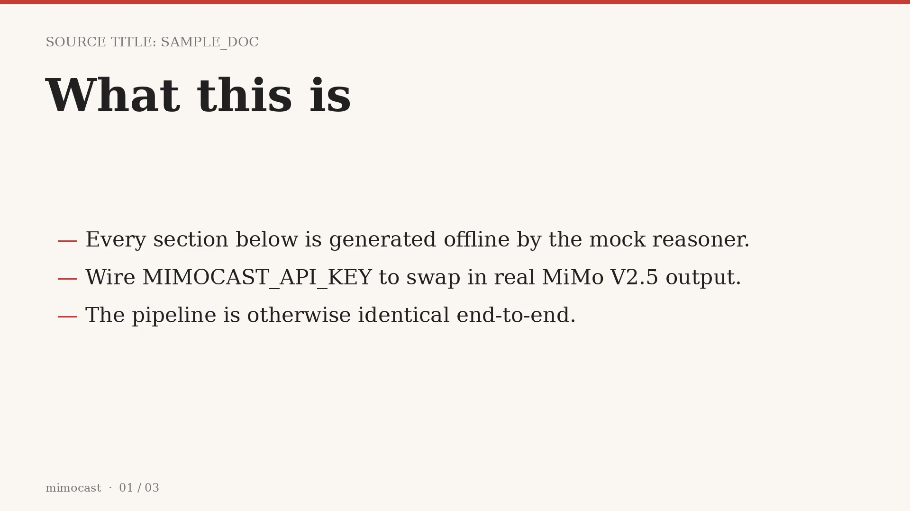
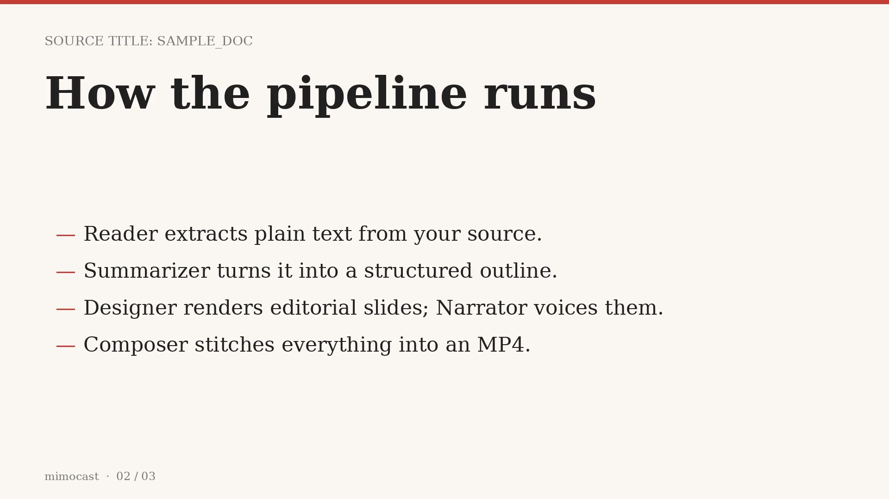
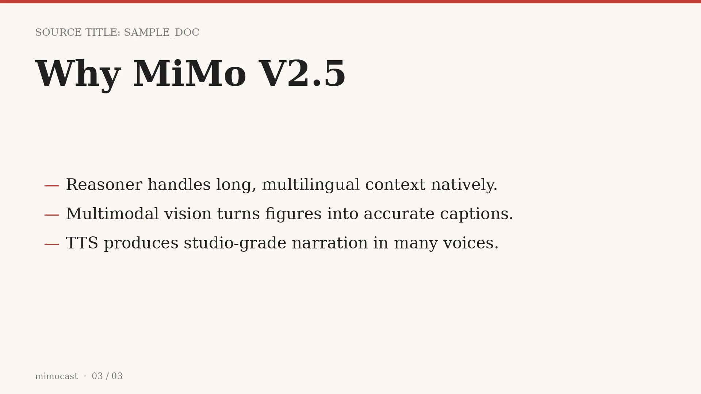

# mimocast

> **MiMo Studio Orchestrator** — turn any document into a narrated video deck via [Xiaomi MiMo V2.5](https://platform.xiaomimimo.com/).

`mimocast` is a four-agent Python pipeline that chains the three model
classes in the MiMo V2.5 family — **reasoner**, **multimodal vision**,
and **TTS** — into a single recoverable workflow:

```
PDF / URL / .md  ──►  Reader  ──►  Summarizer (reasoner)
                                       │
                                       ▼
                       Outline (typed JSON)
                                       │
                                       ├─►  Designer (multimodal) ──►  slide_NN.png
                                       │
                                       └─►  Narrator (TTS)        ──►  narration_NN.mp3
                                                                       │
                                                                       ▼
                                                                   Composer (ffmpeg)
                                                                       │
                                                                       ▼
                                                                   deck.mp4
```

State for every run is persisted to `~/.mimocast/<run_id>.json` after
each phase, so a crashed run can be resumed with `mimocast recover
<run_id>` without re-paying for tokens already spent.

---

## Quickstart

```bash
git clone https://github.com/<you>/mimocast.git
cd mimocast
python -m pip install -e ".[dev]"

# Try it without an API key — the mock client returns canned MiMo-shaped output.
mimocast run examples/sample_doc.md --mock --dry-run --max-sections 4
```

You should see a Rich progress bar walk through `read → summarize →
design → narrate → compose`, then a summary table with the run_id and
artifact paths.

To produce an actual MP4, install `ffmpeg` and drop `--dry-run`.

### Live mode

Get a key at <https://platform.xiaomimimo.com/> and:

```bash
cp .env.example .env
# edit MIMOCAST_API_KEY=...
mimocast run https://arxiv.org/pdf/1706.03762 --max-sections 6
```

The CLI auto-detects mock vs live based on whether `MIMOCAST_API_KEY` is set.

---

## CLI

```
mimocast run SOURCE [--max-sections N] [--mock] [--dry-run] [--demo-tts] [--out DIR]
mimocast recover RUN_ID [--dry-run]
mimocast list
mimocast version
```

| Flag | Effect |
|------|--------|
| `--mock` | Force mock mode even if a key is configured. |
| `--dry-run` | Skip ffmpeg composition (slides + audio still produced). |
| `--demo-tts` | Mock-mode only: route TTS through gTTS so the demo MP4 has audible narration. **Not** a substitute for real MiMo TTS — never label demo-tts output as MiMo. Requires `pip install -e ".[demo]"`. |
| `--max-sections N` | Cap the number of slides (2 ≤ N ≤ 12). |
| `--out DIR` | Override `MIMOCAST_OUT_DIR`. |
| `-L LEVEL` | Log level: `DEBUG / INFO / WARNING / ERROR`. |

### Sample slides

The Designer renders editorial 1920×1080 slides — preview frames from a
mock-mode run live in [`docs/assets/`](./docs/assets/):

| Slide 1 | Slide 2 | Slide 3 |
|---------|---------|---------|
|  |  |  |

---

## Configuration

All settings are read from environment variables prefixed with
`MIMOCAST_` and from a local `.env` file. See [`.env.example`](./.env.example).

| Variable | Default | Purpose |
|----------|---------|---------|
| `MIMOCAST_API_KEY` | *(unset)* | MiMo API key. Empty = mock mode. |
| `MIMOCAST_BASE_URL` | `https://api.xiaomimimo.com/v1` | OpenAI-compatible endpoint. |
| `MIMOCAST_REASONER_MODEL` | `mimo-v2.5-reasoner` | Used by the Summarizer. |
| `MIMOCAST_VISION_MODEL` | `mimo-v2.5-vision` | Used by the Designer for image prompts. |
| `MIMOCAST_TTS_MODEL` | `mimo-v2.5-tts` | Used by the Narrator. |
| `MIMOCAST_TTS_VOICE` | `mimo-female-warm` | Voice id passed to TTS. |
| `MIMOCAST_WORK_DIR` | `~/.mimocast` | Per-run state files. |
| `MIMOCAST_OUT_DIR` | `./out` | Slide / audio / video output. |

---

## Architecture in 30 seconds

* Each agent in `src/mimocast/agents/` implements a single phase.
* The `Orchestrator` (`src/mimocast/orchestrator.py`) runs them in
  sequence and persists `RunState` after every phase.
* `MimoClient` (`src/mimocast/clients/mimo.py`) wraps the MiMo API with
  retries via `tenacity` and a deterministic mock fallback so tests +
  demos run offline.
* All structured payloads are validated with **pydantic v2** schemas in
  `src/mimocast/models/schemas.py`.

See [`docs/architecture.md`](./docs/architecture.md) for the full diagram
and rationale.

---

## Development

```bash
python -m pip install -e ".[dev]"
pytest                # all tests run in mock mode, no API key needed
ruff check src tests
```

Tests cover: reader (text + PDF + multilingual detection), summarizer
JSON-schema enforcement, designer image rendering, narrator audio
generation, orchestrator end-to-end, recover round-trip, and CLI.

---

## License

MIT — see [LICENSE](./LICENSE).

`mimocast` is an independent open-source project and is **not**
affiliated with or endorsed by Xiaomi. "MiMo" is a trademark of its
respective owner; this project simply targets the MiMo OpenAI-compatible
API.
